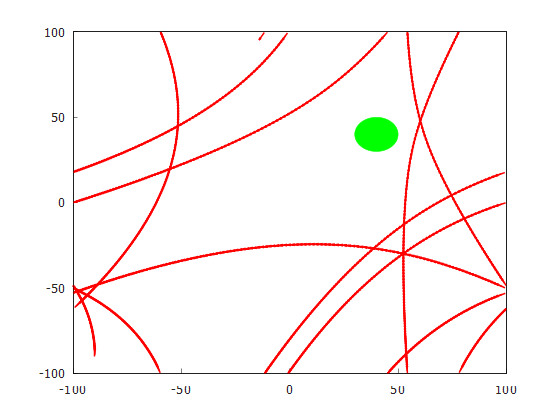
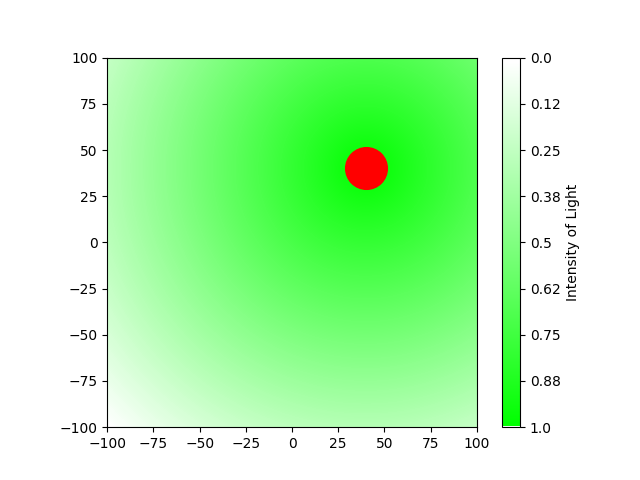
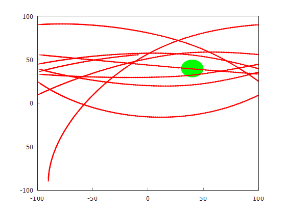
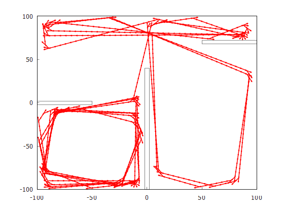
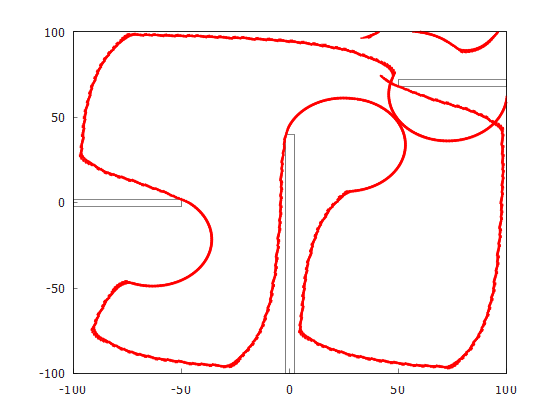

# Evolutionary Robotics

This is a repository containing code! Besides that, it also contains files without code.

## Setup

**Requirements**

In order to setup the project, you should have installed the following
- `cmake>=3.14`
- `gnuplot` (Required for visualization using matplotplusplus)

For `gnuplot` make sure that you can reach it from your console. In case of windows, make sure that you restarted your system after installing gnuplot and adding it to PATH.


**Building the Project**

Go into the `build` directory and run `cmake ..`. Once finished, run `cmake --build .`.

Depending on your system, you can run the code using one of the following commands from the `build` directory:

```console
// Windows
Debug\EvoRob.exe
```

```console
// MacOS
./EvoRob
```

Release mode:
```console
// Windows
mkdir release
cd release
cmake -DCMAKE_BUILD_TYPE=Release ..
cmake --build . --config Release
```

## Usage

Several different robots are implemented. The first uses light sensors - one on the left and one on the right. For this type of robot there are two different controllers based on Braitenberg.

Braitenberg's fear can be simulated using the following command.

```console
EvoRob.exe light fear
```



The red arrows represent the trajectory of the vehicle, while the green dot represents the light source but not its intensity.

This robot will try to escape from the light by setting the speed of the left wheel in proportion to the value detected by the left sensor, assuming that larger values are detected when closer to the light source. The same applies to the right sensor and wheel. In our case, the light reaches the whole area and the readings decrease continuously with the distance of the sensor from the light as illustrated by the following picture.



Braitenberg's aggressor can be simulated using

```console
EvoRob.exe light aggressor
```



The second robot uses proximity sensors. One points directly to where the robot is going. The others are spaced 22.5 degrees apart from the first (to the left and right). The controller is hand crafted and works as follows:
1. If there is nothing in front of the robot, walk straight ahead.
1. Otherwise, if there is nothing to the left of the robot, turn left, but do not move forward.
1. Otherwise, turn right, but do not move forward.
1. Get new sensor values.

This robot can be tested using

```console
EvoRob.exe proximity
```



Note that instead of a light source, this scenario contains walls that the vehicle must avoid.

Also building on the walls and proximity sensor, an evolutionary approach to create robots has been implemented. It can be tested using

```console
EvoRob.exe hill
```

An example trajectory looks like this:

